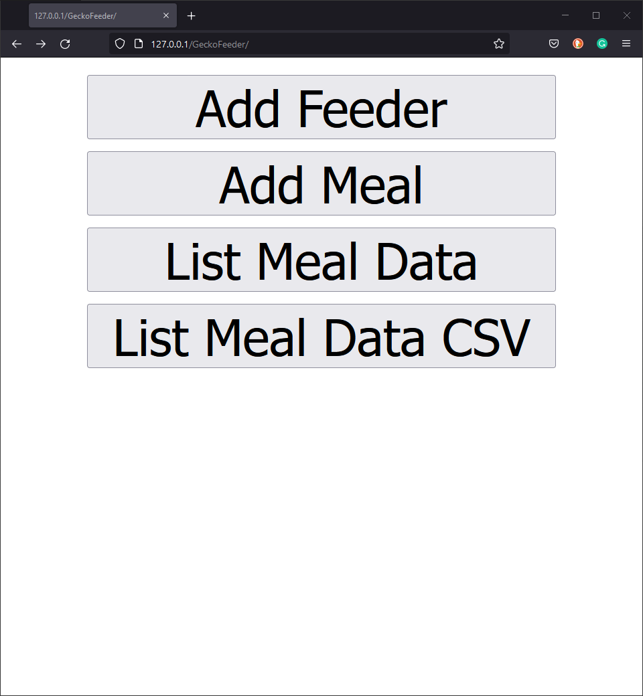
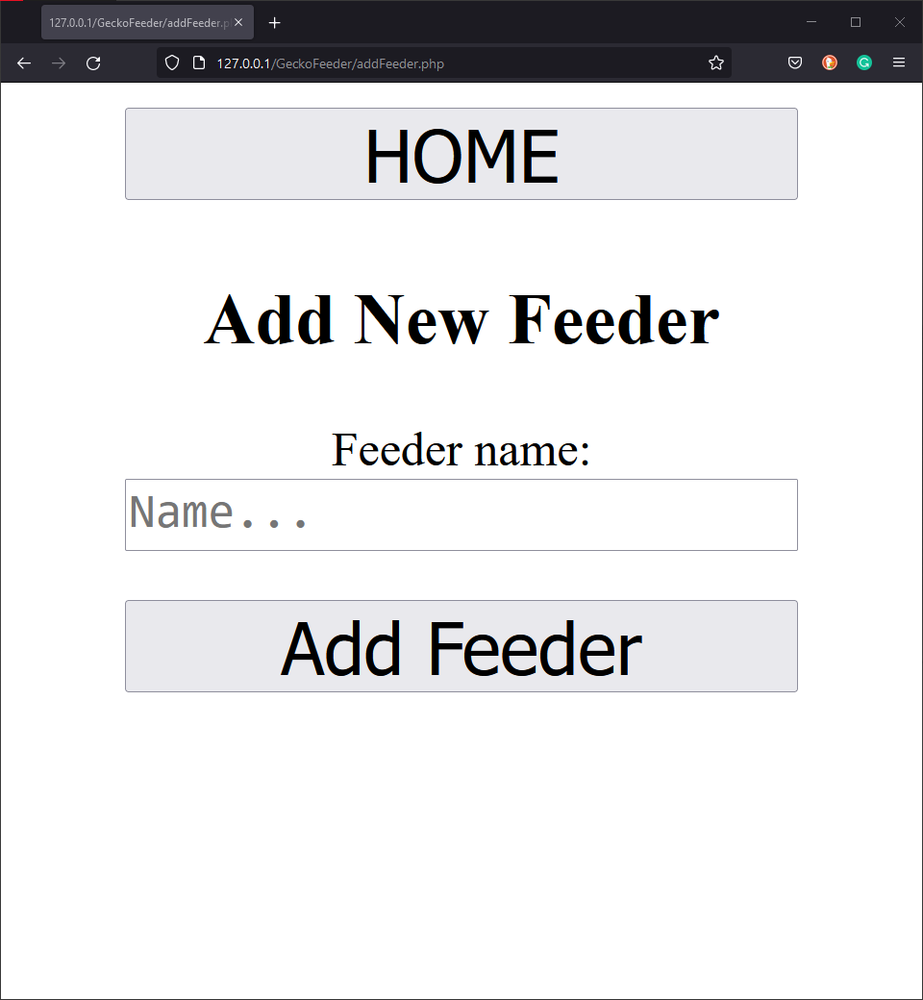
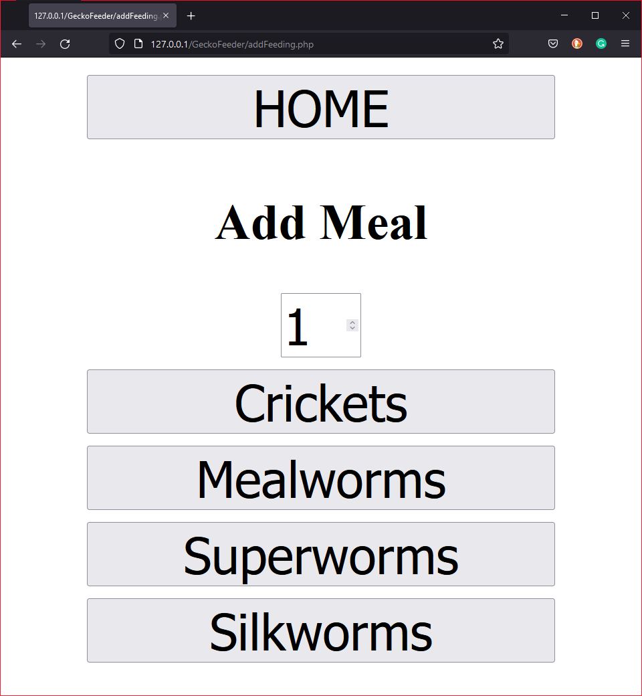
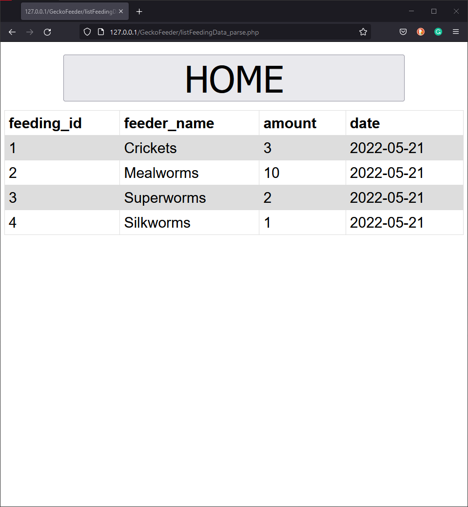
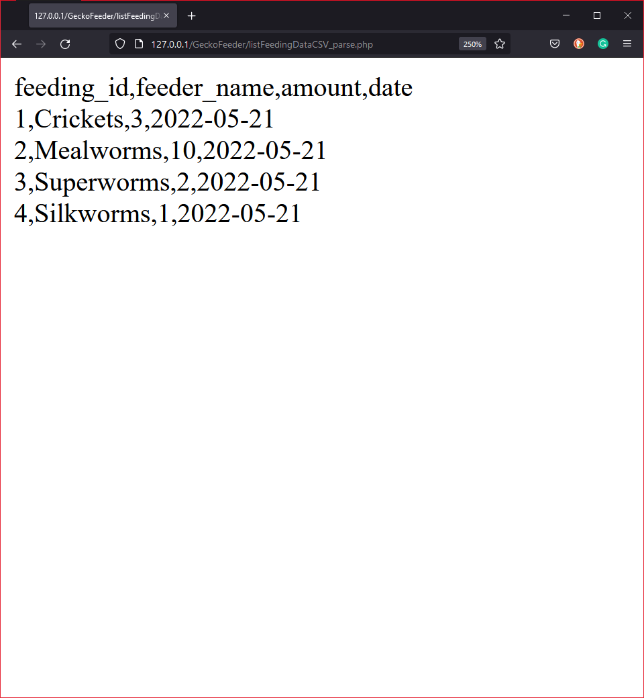

<div id="top"></div>

# Gecko_meal_logger

<!-- ABOUT THE PROJECT -->
## About The Project
In this project, I aim to track the food intake of a pet gecko by logging its meals by means of feeder insect type, amount and feeding date. The data is stored in a database, and data can be added or viewed from a web interface.

<p align="right">(<a href="#top">back to top</a>)</p>


<!-- GETTING STARTED -->
## Getting Started
This section goes over the instructions to set up the database and Web interface. 
<br>

### 1. Run XAMPP

In case you do not yet have XAMPP on your machine. You must first set up and run XAMPP.<br> XAMPP is the most popular cross-platform PHP development environment available from [Apache Friends](https://www.apachefriends.org/index.html).

Required to run:
* Apache
* MySQL
<br>

### 2. Set up the database.
Extract the `database.zip` file to find the `gecko_feeding_db.sql` file. The `gecko_feeding_db.sql` file can be used to set up the database in MySQL in XAMPP.
<br>

### 3. Set up the gecko feeder web page
Extract the files from the `GeckoFeeder.zip` archive to the `htdocs` folder in your XAMPP installation folder.<br>
To access the webpage, open your browser and navigate to the page in your localhost, as shown below.
```sh
http://127.0.0.1/GeckoFeeder/
```

<p align="right">(<a href="#top">back to top</a>)</p>

<!-------------------------------------------------->

<!-- USAGE EXAMPLES -->
## Usage Example
The index page has four navigation buttons, as shown below.
<br>
<div align="center">
    
</div>
<br>

The first button navigates you to the page shown below, allowing you to add new feeder types to the database.
<br>
<div align="center">
    
</div>
<br>

The second button allows you to enter the number of feeders consumed during a meal. The different types of feeders are shown as buttons at the bottom of the page. The meal will be added to the database when you click on the feeder button. An example of the page can be seen below.
<br>
<div align="center">
    
</div>
<br>

The third button will display a table of the meal data stored in the database, as shown below.
<br>
<div align="center">
    
</div>
<br>

The fourth button will display the meal data stored in the database in a CSV format, as shown below.
<br>
<div align="center">
    
</div>


<p align="right">(<a href="#top">back to top</a>)</p>


<!-- CONTACT -->
## Contact
_Johan Christiaan Lamprecht - christiaan3597@gmail.com_

<p align="right">(<a href="#top">back to top</a>)</p>


